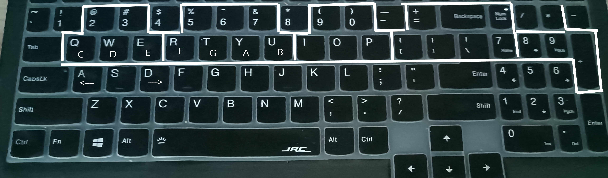

# Why Write this Project
After playing piano online, I found that the keys does not combine as on real pianos, which made them difficult to control. In this project, the keys are combined in the same order as that on the piano. If you find that the keys on your computer do not follow the order, you can change keys.txt under the installation directory. See readme.md under that directory.
# Directory
The project is divided into two parts: the client and the server. To play the game, you just need to download the client, because the server is already deployed. You can open the .sln file in Visual Studio 2019 to see the full source code. Executable files under Release folder are compiled results. To conveniently install the game, just click the .exe file under folder Setup.  
Keyboard mapping:  

